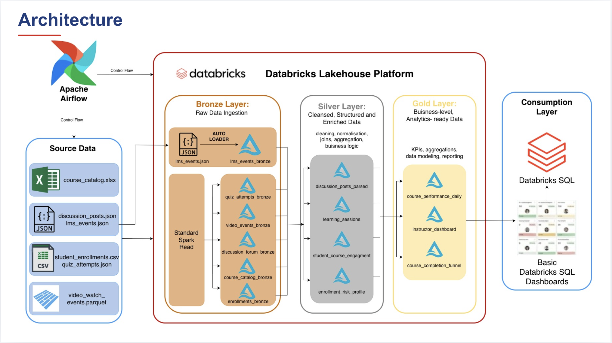
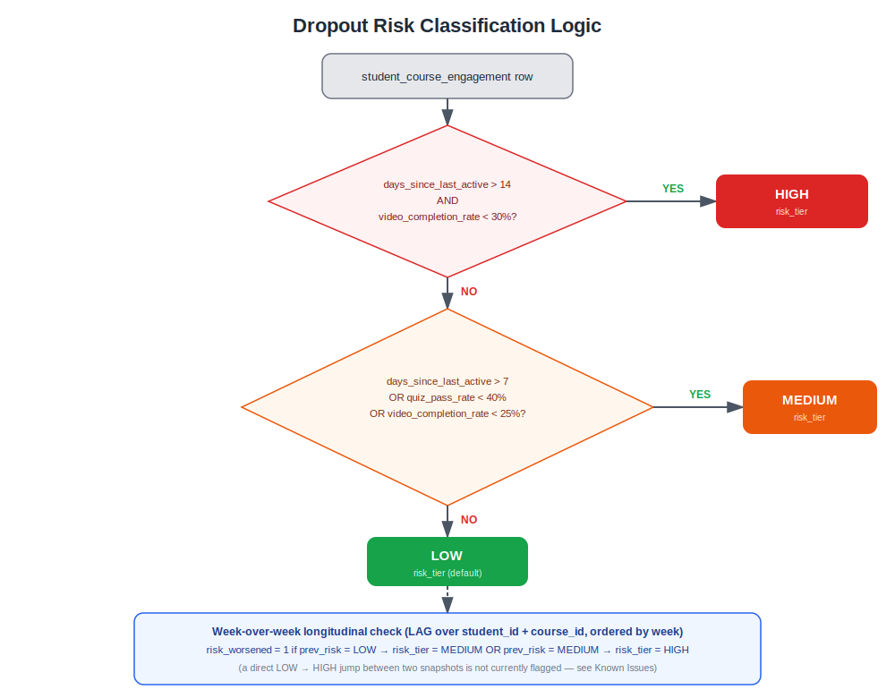
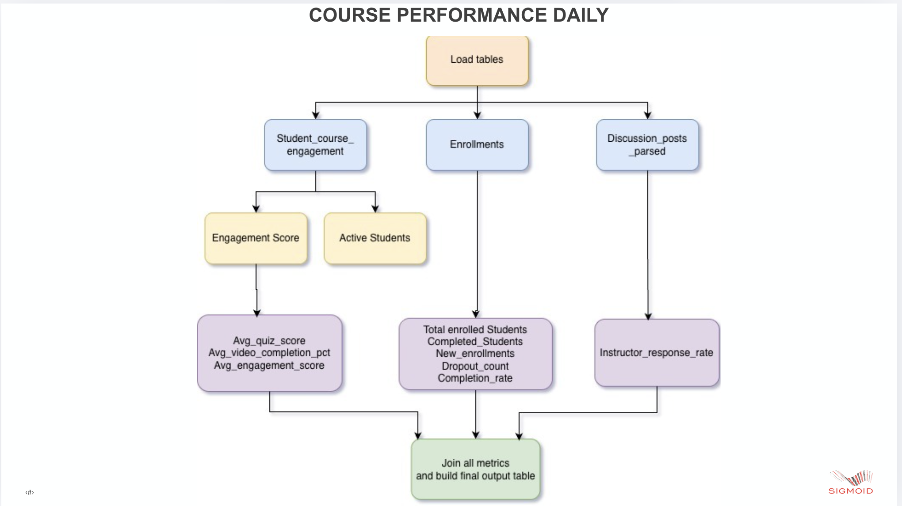
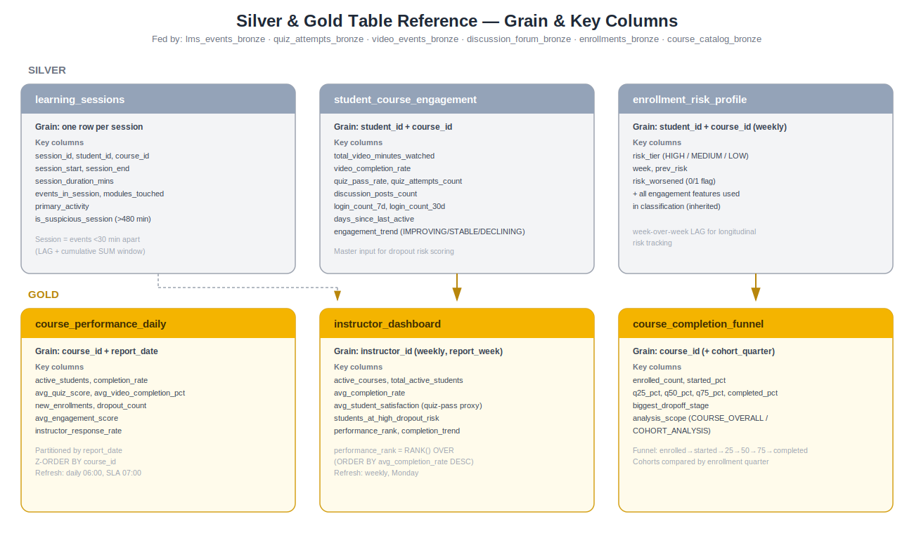
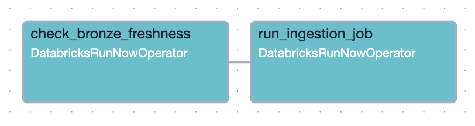
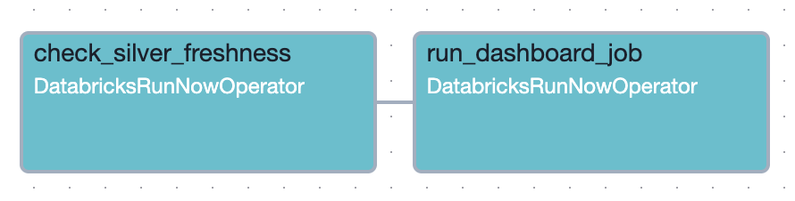
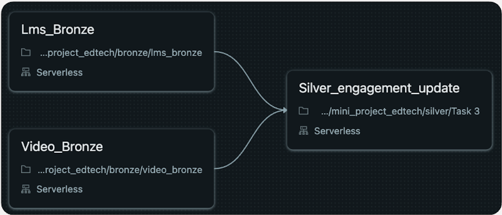
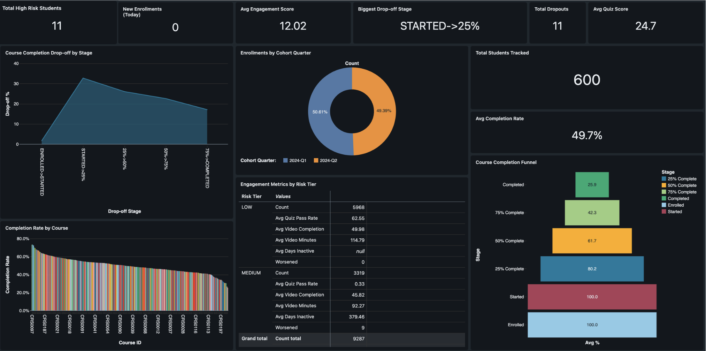

# 🎓 Student Learning Analytics Platform — EdTech Data Pipeline

A Databricks Lakehouse pipeline that turns raw LMS, video, quiz, and discussion-forum activity into engagement scores, dropout risk tiers, and instructor/leadership dashboards for an online learning platform.

> Built on Azure Databricks (Delta Lake, Auto Loader, PySpark) and orchestrated with Apache Airflow.
---

## 📌 Overview

The platform serves ~500,000 active students across 2,000+ courses and was losing **42% of enrolled students to dropout** — with instructors only finding out after the course had already ended. This pipeline exists to close that gap: it ingests multi-modal learning signals (video watch events, quiz attempts, discussion participation, logins) and turns them into:

- **Engagement scores** per student per course
- **Dropout risk tiers** (HIGH / MEDIUM / LOW), refreshed daily, with a **≥14-day early-warning window**
- **Course effectiveness KPIs** and a **completion funnel** to find where students actually drop off
- An **instructor dashboard** ranking performance and surfacing at-risk students, refreshed weekly

### Business objectives
- Reduce dropout rate from 42% → **< 25%** through early intervention
- Daily, per-student instructor dashboard (no more 2-week manual reporting cycles)
- Flag at-risk students **before** they disengage, not after
- Automate monthly course-effectiveness reporting end to end

---

## 🏗️ Architecture

The pipeline follows a **Bronze → Silver → Gold** medallion architecture on Databricks Lakehouse, with Apache Airflow driving two independent schedules (hourly ingestion, daily aggregation).



| Layer | Technology | Purpose |
|---|---|---|
| **Bronze** | Delta Lake + Auto Loader / Spark batch read | Raw ingestion — JSON, CSV, Parquet, XLSX — as-is, with lineage metadata |
| **Silver** | PySpark DataFrames | Session computation, engagement metrics, dropout feature engineering, discussion parsing |
| **Gold** | Spark SQL / PySpark | Course performance KPIs, instructor dashboard, completion funnel |
| **Orchestration** | Apache Airflow (`DatabricksRunNowOperator`) | Hourly Bronze→Silver ingest + daily Silver→Gold with freshness monitoring and Slack alerting |
| **BI** | Databricks SQL | Instructor dashboards, leadership reporting |

---

## 📥 Data Sources

| Source | Format | Volume | Frequency | Key Fields |
|---|---|---|---|---|
| **LMS Events** | JSON (NDJSON) | ~3M events/day | Hourly, from Moodle/Canvas | `event_id`, `student_id`, `course_id`, `event_type`, `event_ts`, `duration_seconds` |
| **Quiz Attempts** | CSV | ~500K rows/day | Daily @ 01:00 | `attempt_id`, `student_id`, `course_id`, `quiz_id`, `score_obtained`, `max_score`, `status` |
| **Video Watch Events** | Parquet | ~8M rows/day | Daily @ 02:00, CDN export | `watch_id`, `student_id`, `course_id`, `watched_seconds`, `completion_pct` |
| **Discussion Posts** | JSON (nested threads) | ~100K rows/day | Daily batch | `post_id`, `thread_id`, `author_student_id`, `parent_post_id`, `is_instructor_post` |
| **Course Catalog** | XLSX | ~2,000 courses | Monthly | `course_id`, `instructor_id`, `instructor_name`, `difficulty_level`, `avg_rating` |
| **Student Enrollments** | CSV | ~1M rows | Daily incremental | `enrollment_id`, `student_id`, `course_id`, `current_progress_pct`, `status` |

---

## 🥉 Bronze Layer — Raw Ingestion

| Table | Ingestion pattern |
|---|---|
| `lms_events_bronze` | Auto Loader (`cloudFiles`, JSON), schema inference, partitioned by `event_date`, filters out future-dated events and null `student_id` |
| `quiz_attempts_bronze` | Batch CSV read with a `max(submit_ts)` **watermark** for incremental loads; flags `status='IN_PROGRESS'` rows that already have a `submit_ts` as logically inconsistent |
| `video_events_bronze` | Batch Parquet read, partitioned by `watch_date`; includes a daily volume-anomaly check (alert if a day's event count falls outside 1M–10M) |
| `discussion_forum_bronze` | NDJSON read; raw payload preserved in a `raw_json` column so downstream parsing logic can evolve without re-ingesting |
| `course_catalog_bronze` | `pandas.read_excel()` → `spark.createDataFrame()` pattern; validates no duplicate `course_id`, `is_active` cast to boolean, `avg_rating` constrained to 0–5 |
| `enrollments_bronze` | Daily incremental CSV; referential-integrity join against the course catalog; deduplicated with a `ROW_NUMBER()` window on `enrollment_id`, then upserted with `MERGE INTO` |

Every Bronze table carries `_source_file`, `_load_ts`, `_schema_version` (and `_last_modified_ts` where updates matter) for lineage and auditability.

---

## 🥈 Silver Layer — Cleansing & Feature Engineering

**`discussion_posts_parsed`** — parses the raw JSON with an explicit `StructType`, then derives:
- `post_depth`: 0 (top-level) / 1 (reply) / 2 (reply-to-reply), via a self-join on `parent_post_id`
- `thread_post_count`: window `COUNT(*)` over `thread_id`
- `instructor_reply_rate`: instructor replies ÷ student posts per thread

**`learning_sessions`** — reconstructs browsing sessions from raw LMS events:
- A new session starts whenever the gap since the previous event for that student exceeds 30 minutes (`LAG` + threshold)
- `session_id` = cumulative `SUM` of the "new session" flag per student, via a window function
- Aggregates `session_duration_mins`, `events_in_session`, `modules_touched`, `primary_activity` (most frequent `event_type` in the session), and flags `is_suspicious_session` for sessions over 8 hours

**`student_course_engagement`** — the master feature table, grain `(student_id, course_id)`:
- Video: `total_video_minutes_watched`, `video_completion_rate`
- Quiz: `quiz_attempts_count`, `quiz_pass_rate`
- Discussion: `discussion_posts_count`
- Login: `login_count_7d`, `login_count_30d`
- Recency: `last_active_date`, `days_since_last_active`
- Trend: `engagement_trend` (IMPROVING / STABLE / DECLINING), derived by comparing weekly LMS event counts via `LAG` over `(student_id, course_id)` ordered by week
- Keys are normalized (`trim` + `upper`) across every source before joining, to guard against inconsistent casing/whitespace between systems

**`enrollment_risk_profile`** — dropout risk classification (see logic below), plus week-over-week longitudinal tracking of risk movement.

---

## ⚠️ Dropout Risk Classification Logic



```text
HIGH   :  days_since_last_active > 14  AND  video_completion_rate < 30%
MEDIUM :  days_since_last_active > 7   OR   quiz_pass_rate < 40%   OR   video_completion_rate < 25%
LOW    :  everything else
```

Risk tier is recomputed weekly and compared against the prior week (`LAG` over `student_id, course_id` ordered by week) to set a `risk_worsened` flag — surfacing students whose risk trajectory is actively getting worse, not just students who are currently HIGH risk.

---

## 🥇 Gold Layer — Business KPIs

### Course Performance Daily
Per `course_id` + `report_date`: active students, completion rate, avg quiz score, avg video completion %, new enrollments, dropout count, engagement score, and instructor response rate. Partitioned by `report_date`, **Z-ORDERed by `course_id`** for fast per-course dashboard queries. SLA: ready by 06:00, alert if not.



### Instructor Dashboard
Per instructor, refreshed weekly: active courses, total active students, average completion rate, a student-satisfaction proxy (average quiz pass rate), count of students at high dropout risk, and a global `RANK() OVER (ORDER BY avg_completion_rate DESC)` performance rank. Historical comparison against a rolling 4-week average classifies each instructor's trend as IMPROVING / DECLINING / STABLE / NEW. Written with `append` mode (current week's partition is deleted and reinserted on rerun, keeping the table idempotent while preserving history).

**The "At-Risk" Monitor** — the dashboard's core early-warning feature: instructors previously only discovered dropouts *after* the course ended. `students_at_high_dropout_risk` is now computed straight from the Silver risk profile and refreshed automatically every morning, handing instructors a prioritized list of struggling students before they quit.

### Course Completion Funnel
Tracks students through `enrolled → started → 25% → 50% → 75% → completed`, computes the drop-off percentage at every stage, and automatically identifies each course's `biggest_dropoff_stage`. Cohort analysis compares funnels by enrollment quarter (e.g. 2024-Q1 vs 2024-Q2) in the same table via an `analysis_scope` column, so no separate join is needed to compare cohorts.

---

## 🗂️ Data Model Reference



---

## 🔄 Orchestration — Apache Airflow

Two DAGs give the pipeline a dual schedule: a fast hourly loop for ingestion, and a slower daily loop for aggregation and reporting.

| DAG | Schedule | Steps | Graph |
|---|---|---|---|
| **Bronze → Silver** | Hourly (`0 * * * *`) | `check_bronze_freshness` → `run_ingestion_job` |  |
| **Instructor Dashboard (Gold)** | Daily @ 05:00 (`0 5 * * *`) | `check_silver_freshness` → `run_dashboard_job` |  |

Both DAGs run on `DatabricksRunNowOperator`, use `catchup=False` to avoid backlog replay on redeploy, and route failures through a shared `slack_alert` callback (`on_failure_callback`) that posts the failed task and DAG ID to Slack. The daily DAG additionally sets `max_active_runs=1` so a slow run can't overlap with the next day's trigger.

The underlying Databricks Jobs mirror this same freshness-gated shape at the notebook-graph level — a Bronze ingestion task feeding a Silver engagement update:



Freshness is enforced as a hard gate *before* the actual job runs — Bronze must have received data in the last 70 minutes, Silver must be no more than ~25 hours stale — and a breach raises an exception (`BRONZE_SLA_BREACH: Data not updated in last 70 mins!`) that fails the task and fires the Slack alert, rather than silently running a job against stale data.

> 📝 DAG source files: `azure_1_group_4.py` (hourly Bronze→Silver) and `azure_1_group_4_instructor_dashboard.py` (daily Gold).

---

## 📊 Results — Live Dashboard



Snapshot from the current run over the generated dataset:

| Metric | Value |
|---|---|
| Total students tracked | **600** |
| Average completion rate | **49.7%** |
| Average engagement score | **12.02** |
| Total high-risk students | **11** |
| Total dropouts | **11** |
| Average quiz score | **24.7** |
| Biggest drop-off stage (platform-wide) | **STARTED → 25%** |

**Funnel retention (avg % of enrolled students reaching each stage):**

| Enrolled | Started | 25% Complete | 50% Complete | 75% Complete | Completed |
|---|---|---|---|---|---|
| 100.0 | 100.0 | 80.2 | 61.7 | 42.3 | 25.9 |

**Engagement by risk tier:**

| Risk Tier | Count | Avg Quiz Pass Rate | Avg Video Completion | Avg Days Inactive | Worsened (w/w) |
|---|---|---|---|---|---|
| LOW | 5,968 | 62.55 | 49.98 | — | 0 |
| MEDIUM | 3,319 | 0.33 | 45.82 | 379.46 | 9 |

The single biggest leak in the funnel is between **Started and 25% Complete** (a ~20-point drop) — this is the highest-leverage point for a content or onboarding intervention, ahead of the completion-stage drop-off that's usually the default assumption.

---

## 🗃️ Repository Structure

```
.
├── bronze/
│   ├── lms_bronze.ipynb
│   ├── quiz_bronze.ipynb
│   ├── video_bronze.ipynb
│   ├── discussion_bronze.ipynb
│   ├── course_cat_bronze.ipynb
│   ├── enrollments_bronze.ipynb
│   └── overall_bronze.ipynb
├── silver/
│   ├── Task1.ipynb            # discussion post parsing + depth/thread metrics
│   ├── Task_2.ipynb           # learning session reconstruction
│   ├── Task_3.ipynb           # student_course_engagement summary
│   ├── Task_4.ipynb           # dropout risk classification
│   └── sh_at.ipynb            # exploratory / QA notebook (see Known Issues)
├── gold/
│   ├── edtech_gold_utils.py   # shared helpers: table registry, schema-safe casts, overwrite util
│   ├── task_3_1_course_performance_daily.ipynb
│   ├── task_3_2_instructor_dashboard.ipynb
│   └── task_3_3_course_completion_funnel.ipynb
├── airflow/
│   ├── azure_1_group_4.py                       # hourly Bronze → Silver DAG
│   └── azure_1_group_4_instructor_dashboard.py   # daily Gold / dashboard DAG
└── assets/                    # diagrams & dashboard screenshots used in this README
```

---

## ⚙️ Setup — Azure Databricks

**1. Unity Catalog structure**
```sql
CREATE CATALOG IF NOT EXISTS edtech_project;
CREATE SCHEMA IF NOT EXISTS edtech_project.edtech_bronze;
CREATE SCHEMA IF NOT EXISTS edtech_project.edtech_silver;
CREATE SCHEMA IF NOT EXISTS edtech_project.edtech_gold;
```

**2. Volumes** (raw source landing zones), one per source under:
```
/Volumes/edtech_project/edtech_bronze/edtech_project/
  ├── lms_events/
  ├── quiz_attempts/
  ├── video_watch/
  ├── discussion_posts/
  ├── course_catalog/
  ├── enrollments/
  └── checkpoints/lms_events/   # Auto Loader checkpoint
```

**3. Cluster / compute**
- Any Databricks Runtime with native Delta Lake support (serverless SQL/jobs compute works for the Gold layer; a small job cluster is sufficient for Bronze/Silver).
- `%pip install openpyxl --break-system-packages` (or just `%pip install openpyxl` on classic compute) is required in the course-catalog Bronze notebook for `pandas.read_excel()`.

**4. Run order**
```
Bronze  → lms_bronze, video_bronze, quiz_bronze, discussion_bronze,
          course_cat_bronze  (must run before enrollments_bronze)
          enrollments_bronze (depends on course catalog for referential integrity)
Silver  → Task1 (discussion) → Task_2 (sessions) → Task_3 (engagement) → Task_4 (risk)
Gold    → task_3_1 → task_3_2 → task_3_3   (task_3_2 optionally reads task_3_1/its own
          prior history for the 4-week trend comparison)
```

**5. Airflow**
- Providers: `apache-airflow-providers-databricks`, `apache-airflow-providers-http`
- Connections needed:
  - `azure_1_group_4` — Databricks connection (host + PAT/service principal token)
  - `slack_connection` — HTTP connection wrapping an incoming Slack webhook, used by `on_failure_callback`
- Register the two Databricks Jobs referenced by `job_id` in the DAG files (freshness-check job and the actual ingestion/dashboard job) before triggering either DAG.

---

## 🐞 Known Issues & Limitations

- **Two divergent course-catalog tables.** `enrollments_bronze` runs its referential-integrity join against a `course_catalog` table built from a CSV read capped at the first 251 rows (behind a notebook cell explicitly marked "don't run this"), while every downstream Gold notebook reads `course_catalog_bronze`, built independently from the XLSX source. These can silently drift out of sync since they're populated from two different files.
- **No incremental/dedup guard on video ingestion.** `video_events_bronze` writes with `mode("append")` and no watermark (unlike `quiz_attempts_bronze`, which tracks `max(submit_ts)`), so re-running the notebook against the same day's Parquet file will duplicate rows.
- **`risk_worsened` only catches single-step transitions.** It flags LOW→MEDIUM and MEDIUM→HIGH week-over-week, but a student who jumps directly from LOW to HIGH between two snapshots isn't flagged.
- **High-cardinality partitioning on discussion data.** `discussion_forum_bronze` is partitioned directly on `post_ts` (a full timestamp) rather than a truncated date, which produces far too many small partitions at scale and hurts write/query performance.
- **Broad exception handling in the historical-trend join.** The instructor dashboard's 4-week trend comparison wraps the read in a bare `except Exception`, so a real failure (permissions, schema drift) looks identical to "no historical data yet" — it should distinguish "table doesn't exist" from other errors.
- **`silver/sh_at.ipynb` is a work-in-progress notebook**, not part of the production Silver path — it writes to a scratch table and references a `trend_df` variable that's never defined before use. Left in the repo for reference but excluded from the run order above.

---

## 🚀 Possible Next Steps

- Reconcile the two course-catalog ingestion paths into a single Bronze source of truth
- Add a proper watermark/merge strategy to `video_events_bronze`
- Extend `risk_worsened` to detect any tier increase, not just adjacent-tier moves
- Re-partition `discussion_forum_bronze` by a derived `post_date` column
- Add automated data-quality assertions (row-count deltas, null-rate thresholds) as an Airflow task ahead of the Silver DAG, rather than inline notebook asserts only
